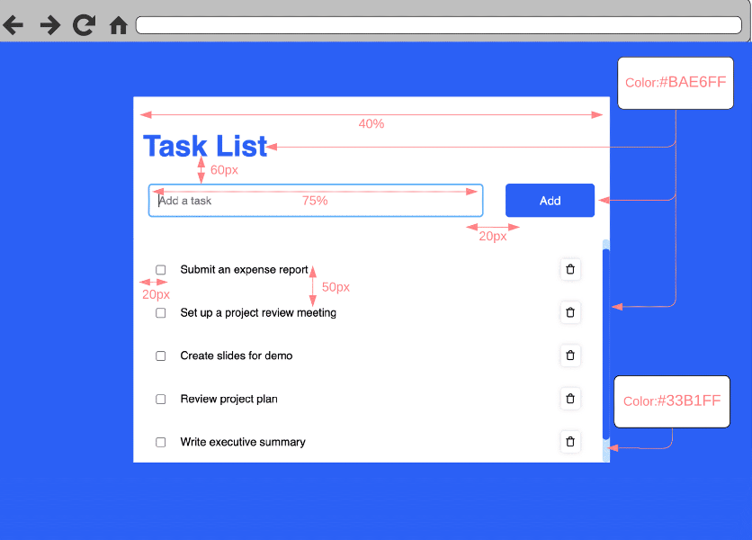
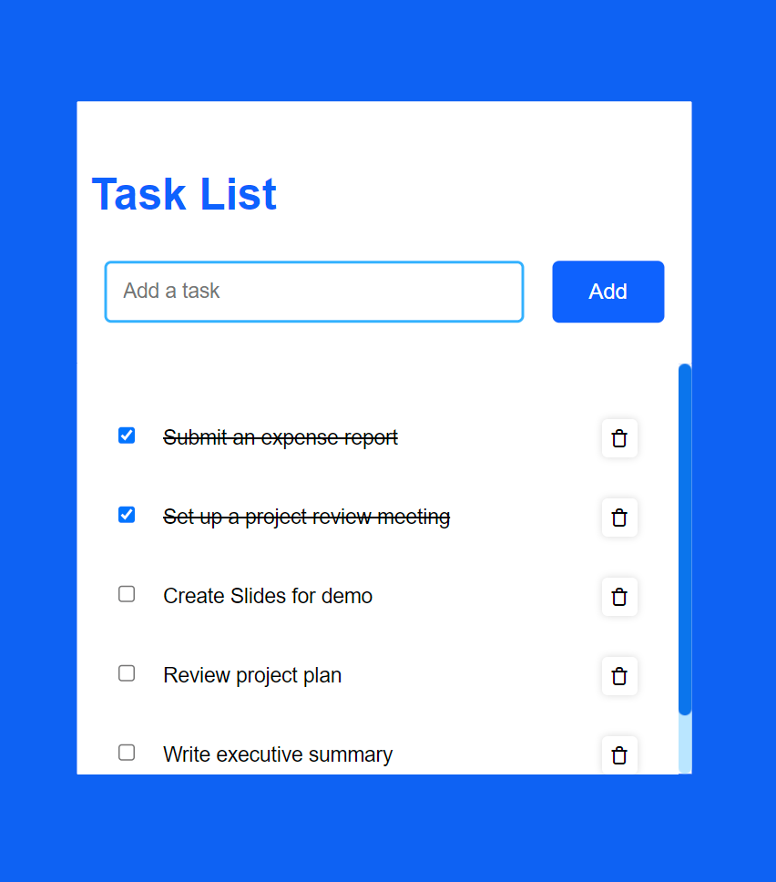

# Front-End Web Development | IBM SkillsBuild

## Web Development Fundamentals Capstone Project

- Develop an Interactive Task List Web Page

### Requirements

- The product manager provided a list of requirements that the web page must meet. The requirements are as follows

  1. User must be able to input a task.

  2. User must be able to add a task by using the keyboard Enter key or by clicking a button.
  3. User’s task must appear on the web page in a structured way.
  4. User must be able to check off a task when completed.
  5. User should have visual confirmation that a task is completed.
  6. User must be shown an error message if they do not enter a task correctly.
  7. Company brand guidelines must be followed.
  8. Task list page must be visually appealing and functional on both desktop and mobile devices.

### Wireframe

The web designer reviewed the requirements and created the following wireframe diagram to provide the team with a visual representation of how the web page should look after it is developed. Take some time to study the wireframe, and pay particular attention to the items in red.

This wireframe diagram documents the complete layout of every design element the completed web page should include, such as:

- The title of the web page, example tasks with checkboxes, and buttons
- The distances that elements should be from each other in pixels (px)
- The width of some elements as a percentage of their container
- The colors for some elements using a hexadecimal code that is used in stylesheets for color

### Interactive Task List Web Page

### Tools

|Tool| Version|
 |----|--------|
 |HTML|5|
 |CSS|3|
 |JavaScript| ES6|
 |Visual Studio Code| 1.82.2|
 |Git|2.41.0|
 |Github repository| |
